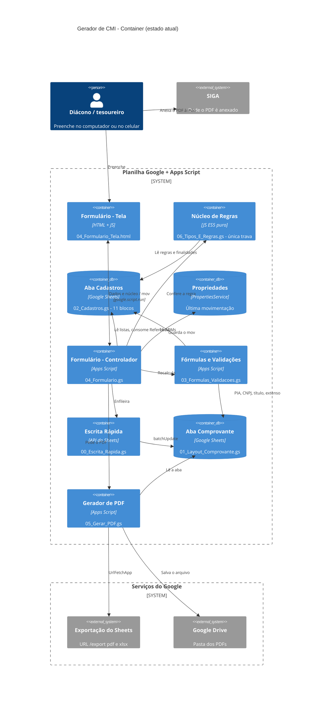
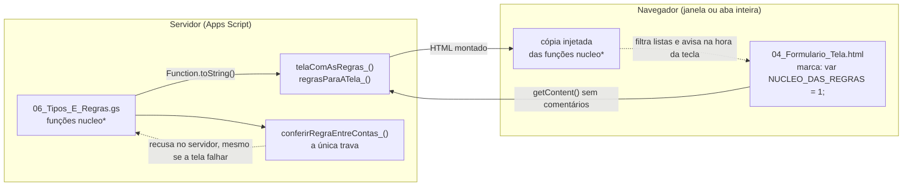
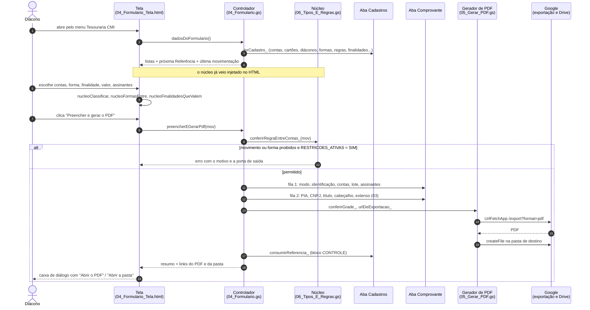
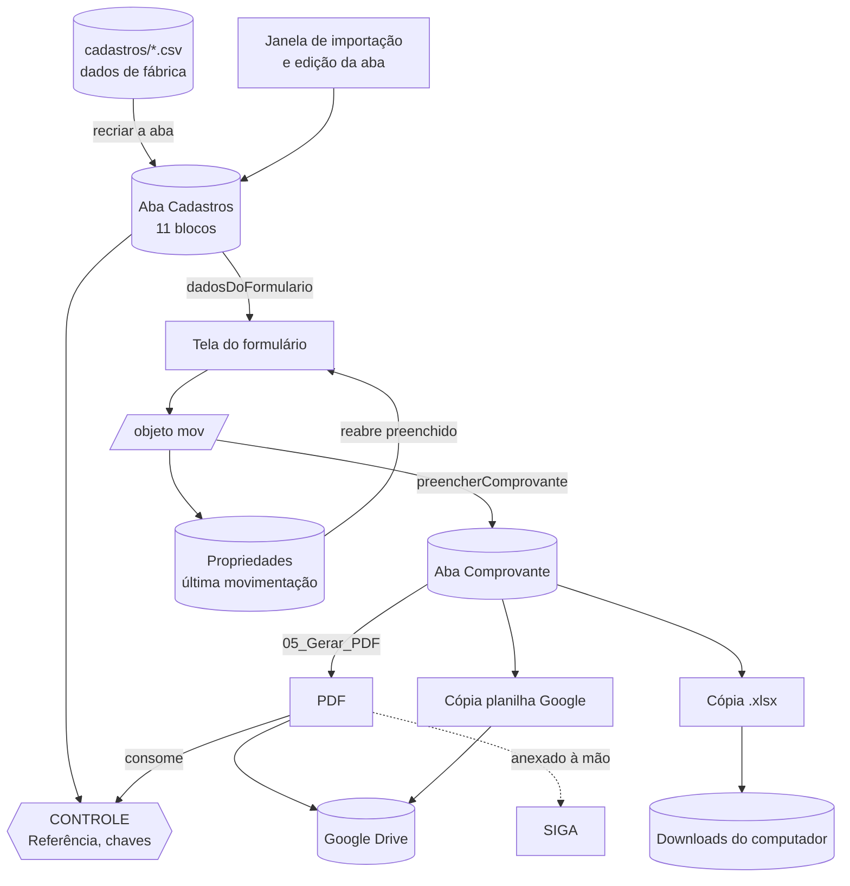

# Arquitetura — Gerador de CMI (estado atual)

> Visão arquitetural do que **existe hoje** no repositório, em diagramas
> Mermaid que o GitHub desenha sozinho. Levantado em 23/09/2026 a partir dos
> arquivos de `apps_script/`. O detalhe campo a campo está em
> [`02_mapeamento_dados_ATUAL.md`](02_mapeamento_dados_ATUAL.md), e as regras
> em [`01_regras_negocio_ATUAL.md`](01_regras_negocio_ATUAL.md).
>
> Não aparece aqui nada que ainda não foi construído (2 ou 3 PDFs automáticos,
> aba Histórico, `.md` de recuperação). Ver a seção 5.

---

## 1. Diagrama C4 — Nível 2 (Container)

Tudo roda dentro de **uma planilha Google com Apps Script**: não há servidor
próprio nem banco de dados de fora. A aba **Cadastros** faz o papel do banco;
a aba **Comprovante** é só a camada de impressão.

### Legenda dos containers

| Container | Arquivo | Camada | O que entra | O que sai |
|---|---|---|---|---|
| Aba Cadastros | `02_Cadastros.gs` | **Fonte de dados** | Dados de fábrica, edição na aba, janela de importação, finalidade nova | Listas para a tela, o núcleo e as fórmulas; a contagem da Referência |
| Formulário (Tela) | `04_Formulario_Tela.html` | **Interface** | Dados + núcleo injetado | O objeto `mov` |
| Formulário (Controlador) | `04_Formulario.gs` | **Controlador** | `mov` | Escritas na folha, pedido de PDF, Referência consumida |
| Núcleo de Regras | `06_Tipos_E_Regras.gs` | **Lógica de negócio compartilhada** | Contas, formas, regras, finalidades (por parâmetro) | Classificação, formas permitidas, finalidades, textos, recusa |
| Fórmulas e Validações | `03_Formulas_Validacoes.gs` | Lógica de cálculo do papel | Folha + ADMs | Extenso, soma, PIA, CNPJ, título, cabeçalho, avisos |
| Escrita Rápida | `00_Escrita_Rapida.gs` | Infraestrutura | Fila de escritas | Um `batchUpdate` (ou o caminho antigo, se o serviço não estiver ligado) |
| Aba Comprovante | `01_Layout_Comprovante.gs` | **Camada de impressão** | Valores escritos | O que vai para o PDF |
| Gerador de PDF | `05_Gerar_PDF.gs` | **Camada de saída** | A aba Comprovante | PDF no Drive; `.xlsx` no computador; planilha Google no Drive |

---

## 2. O núcleo é UMA cópia, usada em dois lugares

O ponto que o C4 não mostra bem: o Núcleo de Regras roda **no servidor e no
navegador**, e é o mesmo texto. Na hora de abrir a janela, o servidor lê o
código-fonte das funções `nucleo*` e o cola dentro do HTML, no lugar da marca
`var NUCLEO_DAS_REGRAS = 1;`.

---

## 3. Fluxo de uma geração de PDF (sequência)

O caminho de um clique em **Preencher e gerar o PDF**, com as idas ao Google
em ordem.

---

## 4. De onde os dados saem e para onde vão

---

## 5. Fora do diagrama porque ainda não existe

| O quê | Onde se encaixaria |
|---|---|
| Os 2 ou 3 PDFs da movimentação num clique | Controlador → Gerador de PDF, um por etapa |
| Cabeçalho da ADM de destino no Recebimento | Fórmulas e Validações (`atualizarCabecalho_(sh, 'destino')`) |
| Aba **Histórico** | Novo ContainerDb, escrito pelo Controlador |
| Arquivo `.md` de recuperação | Gerador de PDF → Google Drive |
| Regras de agrupamento do lote | Núcleo de Regras |
